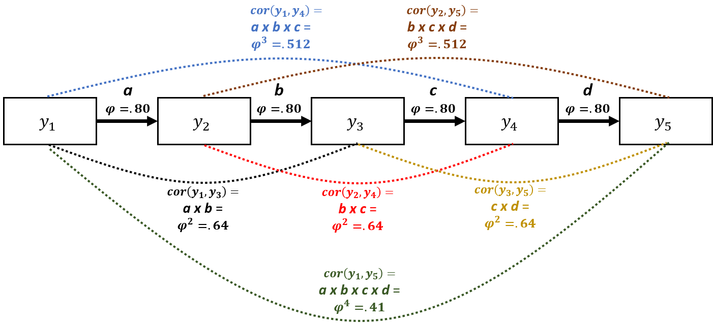
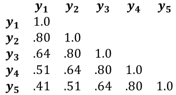

```{r}
knitr::opts_chunk$set(echo = TRUE, warning = F, message = F)
```

# Disclaimer
This is a work-in-progress. I will be revising and adding more material soon. Please send corrections and suggestions to brunwasser@rowan.edu.

# Recommended Reading 

* Harrell F. (2022). [Longitudinal Data: Think Serial Correlation First, Random Effects Second](https://www.fharrell.com/post/re/)
* Pinheiro & Bates (2000). [Mixed-Effects Models in S and S-PLUS](https://link.springer.com/book/10.1007/b98882)
* Pecar & Brabec (2016). [Marginal models via GLS: a convenient yet neglected tool for the analysis of correlated data in the behavioural sciences](https://onlinelibrary.wiley.com/doi/full/10.1111/eth.12514?casa_token=ej3k-YB8xx0AAAAA%3AFiEuaE3nbhMCN_zNGiaRe_g6sCLPEy_vx6MYxmvYHN8fQBWNaNMVnC4TBew4SzwsWdhkTr8IoR0cl3w)

# Overview & Rationale
The purpose of this page is to demonstrate the use of generalized least squares (GLS) regression for modeling longitudinal data. A critical assumption of ordinary least squares (OLS) regression is that errors are independent -- i.e., knowing how much one observation deviates from the population value of interest doesn't tell us anything about the size of deviations among other observations. When individuals provide repeated observations, e.g., in a longitudinal study, this assumption is untenable. Let's say that individuals participants provide outcome data at 5 time points. We would expect the 5 data points provided by the same individual to be correlated -- some individuals will have a general tendency to have negative errors (i.e., they generally score low on the outcome relative to the population) while others will have positive errors (i.e., they generally score high on the outcome relative to the population). OLS regression (and generalized linear models more broadly) won't do in these scenarios because observations from the same individuals are inherently correlated. 

Let's say that you had 500 participants who each provided outcomes measurements at 5 time points (assume no missing data for the time being): Your dataset would have 2,500 observations. If you run an OLS regression, the software will think that you have $N=2,500$, with each data point providing unique information. But in reality, each subsequent data point provided by an individual contains only partly new/unique information and partly redundant information. You can think of each individual participant as being a cluster containing 5 correlated data points. The higher the within-person (i.e., within-cluster) correlation, the less unique information each data point provides. The consequence of ignoring the within-person correlations is that you will get standard errors and *p* values that are too small and confidence intervals that are too narrow (i.e., inflated Type I errors). The software assumes that your sample size is much larger than it really is and therefore underestimates the amount of uncertainty in your parameter estimates.

GLS addresses this problem by allowing you to specify patterns of within-cluster (in this case, within-person) correlations for the outcome variable so that we are no longer assuming that observations from the same cluster are independent. There are many different correlation patterns that you could specify depending on your assumptions about how the within-cluster data points are correlated. We will deal only with situations where you have longitudinal data and repeated outcome measurements are clustered within individual participants. Further, we will implement only one common form of **temporal correlation**: the first-order autocorrelation structure ($AR_1$). The $AR_1$ structure assumes that outcomes measured at adjacent time points are the most strongly correlated and that the strength of the correlation deteriorates the greater the distance between the two measurements.  

Imagine you took weekly measurements of depressive symptoms over 5 weeks. You then have 5 depression measurements ($y$) per person ($i$) taken at equally spaced time points ($t$). So depressive symptoms for person 1 at the five time points could be written as ($y_{it}$): $y_{11}$, $y_{12}$, ... , $y_{i5}$. The $AR_1$ model would say that measurements at adjacent time points have the strongest correlation: e.g., $cor(y_{it}, y_{it+1})$ > $cor(y_{it}, y_{it+2})$. We will also assume that the correlation between all adjacent time points is constant: $cor(y_{it-1}, y_{it})$ = $cor(y_{it}, y_{it+1})$ = ... = $cor(y_{iT-1}, y_{iT})$. This might be a reasonable assumption when you measure the outcome variable at constant intervals. In a GLS model with an $AR_1$ error structure, the correlation between adjacent time points is a parameter estimated in the model ($\phi$ = Greek letter phi): $cor(y_{i1}, y_{i2})$ = $cor(y_{i2}, y_{i3})$ = $\phi$. Once we know what the correlation between two adjacent time points ($\phi$) is, we assume that the correlation between more widely spaced assessments can be determined simply by raising $\phi$ to a power that is equal to the number of time units that separates the two measurements. Outcomes spaced two time units apart (i.e., $y_{i1}$ and $y_{i3}$; $y_{i2}$ and $y_{i4}$; $y_{i3}$ and $y_{i5}$) are assumed to be correlated at $\phi^2$. Outcomes spaced three time units apart (i.e., $y_{i1}$ and $y_{i4}$; $y_{i2}$ and $y_{i5}$) are assumed to be correlated at $\phi^3$, and so on. Thus, the correlation between outcomes measured at two time points deteriorates exponentially as the space between the two time points increases. 

The $AR_1$ model might be more easily understood through the path diagram below. It displays an $AR_1$ model where the outcome ($y$) is measured at five equidistant time points. There are direct effects (unidirectional arrows) of $y$ on itself at the next time point. $\phi$ is the correlation between all equally spaced, adjacent time points $y_{t-1}$ on $y_t$ = .80. We could use Wright's tracing rules to calculate the correlation between all measurements by simply multiplying the path $\phi$ values together along all arrows between the two time points of interest. For example, to calculate the correlation between $y_1$ and $y_3$, we would multiply *path a* times *path b* = $\phi^2$ = .80 x .80 = .64. Note, this would be equal to the correlation between $y_2$ and $y_4$ (path *b* times path *c*) as the distance between $y_2$ and $y_4$ is the same as the distance between $y_1$ and $y_3$. This could also be thought of as a mediation model: e.g., the effect of $y_1$ on $y_5$ is entirely indirect (fully mediated) through $y_2$, $y_3$, and $y_4$. The dotted lines connecting measurements represent correlations that result from the $AR_1$ process. 



<br>

We can represent the $AR_1$ correlation structure very succinctly in a correlation matrix (see below). You can see how the correlation between measurements diminishes exponentially as the distance in time between them increases: $cor$($y_1$, $y_2$) = $\phi$ = .80, whereas $cor$($y_1$, $y_5$) = $\phi^4$ = .41. If we were to use an OLS regression model, we would be assuming that all off-diagonal elements of the correlation matrix would equal 0 -- i.e., the repeated measurements are independent/uncorrelated. 




# Workspace setup
We will be using several R packages. If you have not used these packages before, you need to install them using the code below (remove the # characters at the beginning of each row first so that R does not ignore those lines). Installation only needs to performed once on your computer. Once the package is installed, you can simply read it into your workspace in future R sessions. 
```{r install}
# install.packages('rms')
# install.packages('Hmisc')
# install.packages( 'nlme' )
# install.packages( 'piecewiseSEM' )
# install.packages( 'mvtnorm' )
```


Load the required packages into your workspace. 
```{r load}
require( rms )
require( Hmisc )
require( nlme )
require( piecewiseSEM )
require( mvtnorm )
```

# Simulate a phony dataset
We simulate a phony data set using the *mvtnorm* package that is suitable to use with GLS. The dataset will have a continuous outcome variable ($y$; measuring quality of life), a binary and time-invariant predictor variable indicating whether or not individuals experienced childhood abuse ($x_{1}cat$), a continuous time-invariant predictor measuring optimism ($x_2$), and a continuous time variable indicating how many weeks passed at each time point since the start of the study ($weeks$). Let's say the purpose of the study is model the mean trajectory of quality of life over time (5 time points) and evaluate the extent to which the predictor variables account for variability in quality of life. 

The code below can be skipped if you are not interested in seeing how we created the phony data. A couple of things to note about the simulated data:

* The correlation structure among the repeated assessments is intentionally simulated to match the $AR_1$ structure described above, with $\phi=.80$.
* The mean trajectory of the outcome variable is simulated to be nonlinear, as is common in longitudinal research. This will allow us to demonstrate the utility of restricted cubic splines to capture nonlinear mean trajectories.
```{r}
s <- matrix(c( 1.0, .80,  .64, .51, .41, -.35, .40,  
              .8,   1.0,  .80, .64, .51, -.35, .40,
              .64,  .80,  1.0, .80, .64, -.35, .40,
              .51, .64,  .80, 1.0, .80, -.35, .40,
              .41,  .51,  .64, .80, 1.0, -.35, .40,
              -.35,-.35, -.35,-.35,-.35,  1.0,-.15,
              .40,  .40,  .40, .40, .40, -.15, 1.0 ),
            ncol=7)

m <- c( -1, 0, .5, .75, .5, .5, .5 )

set.seed( 1 )
df <- data.frame( rmvnorm( n = 500, mean = m, sigma = s ) )

colnames( df ) <- c('y1','y2','y3','y4','y5','x1','x2')


df$x1cat <- factor( ifelse( df$x1 > .5, 1, 0 ), levels = 0:1, labels = c( 'Abuse Absent','Abuse Present' ) )
               

dflong <- reshape( df,
                   direction = 'long',
                   varying = list( c('y1','y2','y3','y4','y5') ),
                   times = 1:5,
                   ids = row.names( df )
                   )

label( dflong$x2 ) <- 'Optimism'
label( dflong$x1cat ) <- 'Childhood Abuse'     
colnames( dflong )[5] <- 'y'
label( dflong$y ) <- 'Quality of Life'


set.seed( 2 )
dflong$weeks <- rnorm( 2500, mean = dflong$time, sd = .1 )
label( dflong$weeks ) <- 'Weeks from Baseline'

dflong1 <- dflong[ order( dflong$id, dflong$time ), ]
dflong1$id <- as.numeric( dflong1$id )
label( dflong1$id ) <- 'Unique Participant Identifier'
dflong1$x1 <- NULL

```

# Explore Data Set
The new data set (*dflong1*) is in the long format. There are 500 participants who completed 5 assessments. The data frame has 2500 rows (500 participants x 5 time points each). For convenience, there is no missing data. We can use the describe() function from the *Hmisc* package to summarize the data. Nesting the describe() function within the html() function will produce nicely formatted output with plots of the variable distributions. You can also use the View() function in R to view the dataframe. This will help you see that each participant has 5 rows corresponding to each assessment.

```{r}
options( digits = 2 )
html( describe( dflong1 ) )
```
<br>

We can use the summaryM() function from *Hmisc* to look at descriptive statistics (1st quartile, median, and 3rd quartile) for $y_{it}$ at each time point.
```{r}
options( digits = 2 )
html( summaryM( y ~ time, data = dflong1 ) )
```


To allow us to make plots of our model results, we will use the datadist() function from the *rms* package. This will save properties of the study variables that will make plotting results easier later. We first create an object (*dd*) that contains the distributions of the data from our final dataset (*dflong1*), and then we use the options() functions to tell R that the distribution data is contained in the *dd* object. Note, you should only do this after you have finalized your dataset. If you make subsequent changes to the dataset without updated the data distribution object, you will get errors.    

```{r}
dd <- datadist( dflong1 )
options( datadist = 'dd' )
```


# Run a GLS Model

Here we run a GLS model using the simulated dataset. We regress our continuous outcome variable (**y**: Quality of life) on: 

* the variable coding weeks from baseline to capture a mean time trend (**weeks**)
* the binary predictor indicating whether the person wsa a victim of childhood abuse (**x1cat**)
* the continuous variable representing levels of optimism at baseline (**x2**)

It's often not reasonable to assume that the outcome variable changes linearly over time. Therefore, we use the rcs() function to estimate the time trend using a restricted cubic spline with 3 knots. This will allow the time trend to be highly flexible and nonlinear. Restricted cubic splines require the estimation of $k-1$ degrees of freedom ($df$), where $k$ is the number of knots. As we are asking for only 3 knots, the time effect will require $df=2$. Restricted cubic splines offer a nice middle ground between making the restrictive assumption of linearity and overfitting the model.

Note, the specification of the GLS model looks a lot like an OLS regression model in R. The major difference is the argument: *"correlation = corAR1( form =~ time | id)"*. This argument tells the software that we want an $AR_1$ correlation structure with repeated time points (*time* variable) clustered within individuals (*id* variable).  

```{r}
m1 <- Gls( y ~ rcs(weeks, 3) + x1cat + x2,
           correlation = corAR1( form =~ time | id),
           na.action = 'na.omit',
           method = 'REML',
           data = dflong1 
           )
```


When we run the model and use the print() function, we see that all of the predictor variables are strongly significant. Notice, that because we used a restricted cubic spline to estimate the effect of week of follow-up (*weeks*), there are two coefficients for this effect; the first is positive and the second is negative. Also, note that the output gives us an estimate of $\phi$ = .74, which is pretty close to the population value in our simulation (.80).
```{r}
print( m1 )
```

It can be helpful to get point estimates and confidence intervals together. We can do this by binding together the output from the coef() and confint() functions, as shown below.
```{r}
m1.coef <- cbind( coef(m1), confint(m1) ) 
colnames( m1.coef) <- c( 'Est','LCI','UCI' )
m1.coef
```


We can use the anova() function to get Wald $\chi^2$ tests for each predictor. This gives us an overall test of the effect of *weeks* ($df=2$) and a test of whether there is evidence of nonlinearity in the effect of *weeks* -- which is significant and supportive of our choice to model a nonlinear time effect with the restricted cubic spline. 

```{r}
anova( m1 )
```

We can also plot the anova() output. The y-axis shows the predictors included in the model, and the x-axis shows the $\chi^2$ subtracting the number of *df*s associated with the test. This can give us a sense of which variables are most important in our model, with variable importance increasing as you go down the y-axis. The $\chi^2$ and *p* values are provided in the right margin. 

```{r}
plot( anova( m1 ) )
```

One of the most helpful features of the *rms* package is the ability to plot model-based predictions. 
```{r}
ggplot( Predict( m1, weeks, x2=c( quantile( df$x2)[2], quantile(df$x2)[3], quantile(df$x2)[4] ), x1cat ) ) +
  labs( title = 'Model-Based Predictions',
        y = 'Predicted Quality of Life Score',
        ) +
  scale_color_discrete( labels = c('1st Quartile','2nd Quartile','3rd Quartile'), name = 'Optimism Level' ) +
  theme( plot.title = element_text( color = 'darkblue', face = 'bold', hjust = .5, size = 16) )
```

To this point, we've assumed that the error variance is constant across the 5 time points (homoscedasticity). These phony data were simulated to have constant error variances. But often this assumption will not be tenable. For example, an intervention or exposure might influence not only mean levels of an outcome, but also the variance. We can allow for heteroscedastic error variances over time by updating our model (using the update() function) and adding the varIdent argument, as demonstrated below. [For some reason, I get an error when comparing the nested models fit with the Gls() function in the *rms* package -- almost certainly user error. So, I refit the models using the gls() function in the *nlme* package.]
```{r}
m1.nlme <- gls( y ~ rcs(weeks, 3) + x1cat + x2,
           correlation = corAR1( form =~ time | id),
           na.action = 'na.omit',
           method = 'REML',
           data = dflong1 
           )

m2 <- update(m1, weights = varIdent(form =  ~ 1 | time ) )
m2.nlme <- update(m1.nlme, weights = varIdent(form =  ~ 1 | time ) )
```

Our first model with constant variances (*m1*) is hierarchically nested within the second model. Therefore, we can compare the models with a likelihood ratio test.

```{r}
anova( m1.nlme, m2.nlme )
```

<br>

We would also want to evaluate tenability of the normality of errors assumption by seeing whether the model residuals are approximately normal. I used the *qqplotr* package in R to make a qq plot -- could also do this easily using base R or functions built in to *ggplot2*. 
```{r}
m1.resid <- data.frame( residual = resid( m1.nlme ) )

require( qqplotr )
qq <- ggplot( m1.resid, mapping = aes(sample = residual)) +
    stat_qq_band() +
    stat_qq_line() +
    stat_qq_point() +
    labs(x = "Theoretical Quantiles", y = "Sample Quantiles")
qq
```


# Compare the GLS & OLS Models

If we rerun our model using OLS -- ignoring the correlation of observations within individuals -- we can see that the confidence intervals for the two primary predictors are 1.7 times larger in the GLS model than in the OLS model. 

```{r}
m1.ols <- ols( y ~ rcs(weeks, 3) + x1cat + x2,
           data = dflong1 
           )

m1.ols.coef <- cbind( coef( m1.ols), confint( m1.ols ) ) 
colnames( m1.ols.coef ) <- c('Est','LCI','UCI' )

coef.gls.ols <- data.frame( rbind( m1.coef, m1.ols.coef ) )

coef.gls.ols$model <- factor( rep( 1:2, each = 5 ), levels = 1:2, labels = c('GLS','OLS')  )
coef.gls.ols$var <- rep( c('Intercept','Week-1','Week-2','Abuse','Optimism'), 2 )
coef.gls.ols$ystart <-  rep( 1:5, 2)
coef.gls.ols$yend <-  rep( 1:5, 2)

coef.gls.ols1 <- subset( coef.gls.ols, var == 'Optimism' | var == 'Abuse' )

ggplot( coef.gls.ols1, aes( x = Est, y = var, color = model ) ) +
  geom_point( position =  position_dodge( width = .5), size = 2 ) +
  geom_errorbarh( aes( xmin = LCI, xmax = UCI ), position =  position_dodge( width = .5), height = 0 )
 
coef.gls.ols1$width <- coef.gls.ols1$UCI - coef.gls.ols1$LCI
```

